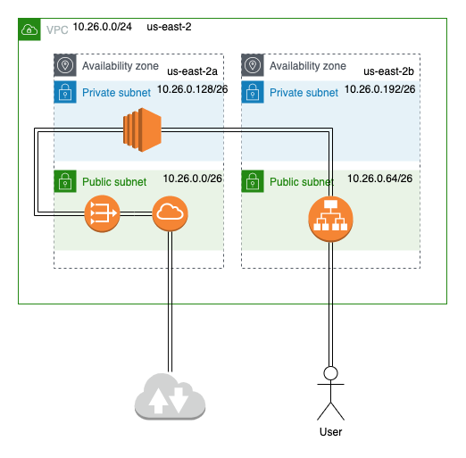
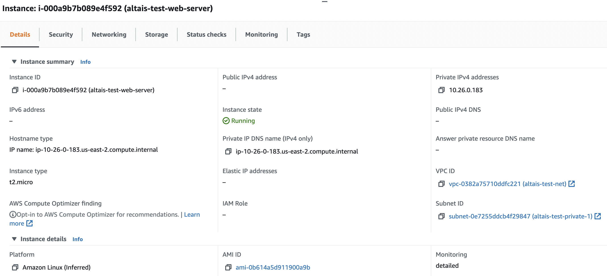
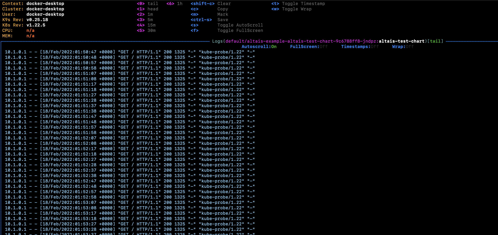

# sre-coding-challenge

## Infrastructure

The infrastructure designed to solve this challenge was designed to take into account high availability scenarios
and resilience.



### Components

- VPC

The VPC for this challenge that I chose was 10.26.0.0/24 because with the given requirements only one instance need to
be deployed on this network.


- SUBNETS

To avoid high capacity issues, I decided to create four subnets divided into two availability zones, the idea behind
it is to create replicas of the resources like nat gateways, ec2 instances, and load balancer for redundancy and high viability.


- ROUTER TABLES

The four subnets are divided into two types of public subnets and private subnets, the public subnet allocates the
internet gateway and load balancers, the private subnets are meant to deploy compute resources securely behind the nat gateway .


- SECURITY GROUPS

In this challenge, I don't use security groups to enforce the rules for the instance, I use network ACLs instead.


- NETWORK ACL

The private ACL is attached to the private subnets with restrictive rules to the access, for access to the web server
only for the port 80 and for the AWS resources is open a list of nonstandard ports.


The public ACL allow all the incoming traffic from internet to access the instances.


- EC2

The ec2 instance are deployed in the private subnet to increase the security removing the public ip.



- LOAD BALANCER
The load balancer is attached to the instance for expose the web server


- S3
The s3 bucket was create with a trigger SNS topic when changes are detected in the bucket.


- SNS
The SNS topic can be used by application or microservice to notify al the stakeholders of the process.


# Use instructions

## Terraform configuration

The terraform files are located in the folder aws and contains the follow files:

```
aws
├── services
│   ├── compute
│   │   ├── ec2
│   │   │   ├── keys
│   │   │   ├── main.tf
│   │   │   ├── output.tf
│   │   │   ├── scripts
│   │   │   │   └── install_apache.sh
│   │   │   └── variables.tf
│   │   └── load_balancing
│   │       └── clasic
│   │           ├── main.tf
│   │           └── variables.tf
│   ├── network
│   │   ├── subnets
│   │   │   ├── main.tf
│   │   │   ├── output.tf
│   │   │   └── variables.tf
│   │   └── vpc
│   │       ├── main.tf
│   │       ├── outputs.tf
│   │       └── variables.tf
│   └── storage
│       └── s3_with_trigger
│           ├── main.tf
│           └── vriables.tf
└── stack
    ├── backend.tf
    ├── infra.tfvars
    ├── main.tf
    ├── providers.tf
    └── variables.tf
```

## configuration previous first run

* in the file aws/stack/backend.tf configure the s3 bucket for storage the state and the aws cli profile
* in the file aws/stack/infra.tfvars change the profile of the aws cli

for execute the terraform commands use the bellow examples:

* validate
```
    $ cd aws/stack/
    
    $ terraform validate
```

* plan
```
    $ cd aws/stack/
    
    $ terraform plan -var-file=infra.tfvars
```

* apply 
```
    $ cd aws/stack/
    
    $ terraform apply -var-file=infra.tfvars
```

## Run the tests

The tests are located in the tests directory.

* the first step is the installation of the go modules

```
    $ cd tests
    
    $ go get
```

* execute the tests

```
    $ cd tests
    
    $ go test vpc_test.go
```

## s3 trigger on update

For test the s3 SNS notification a script with the logic to upload files to the s3 is in the root directory
upload_s3.sh 

### considerations

* Change the variable AWS_PROFILE to set the desired profile to run the script

## Helm chart

The helm chart was tested with docker desktop with the kubernetes feature enable

```
helm
└── altais-test-chart
    ├── Chart.yaml
    ├── charts
    ├── templates
    │   ├── NOTES.txt
    │   ├── _helpers.tpl
    │   ├── deployment.yaml
    │   ├── hpa.yaml
    │   ├── ingress.yaml
    │   ├── service.yaml
    │   ├── serviceaccount.yaml
    │   └── tests
    │       └── test-connection.yaml
    └── values.yaml
```

### Runtime


### Helm installation

```
    $ cd helm
    
    $ helm install altais-example ./altais-test-chart
```

* All the resources created


* The application logs


* start port forwarding to the application on the port 8080

```
    $ kubectl port-forward POD_NAME 8080:80
```


* see the application in the web browser

